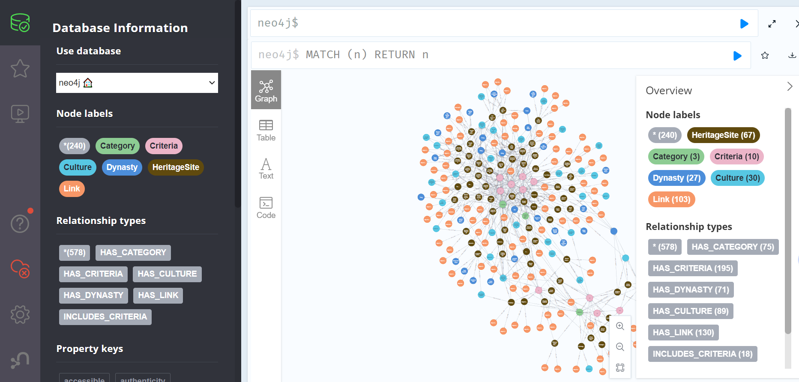
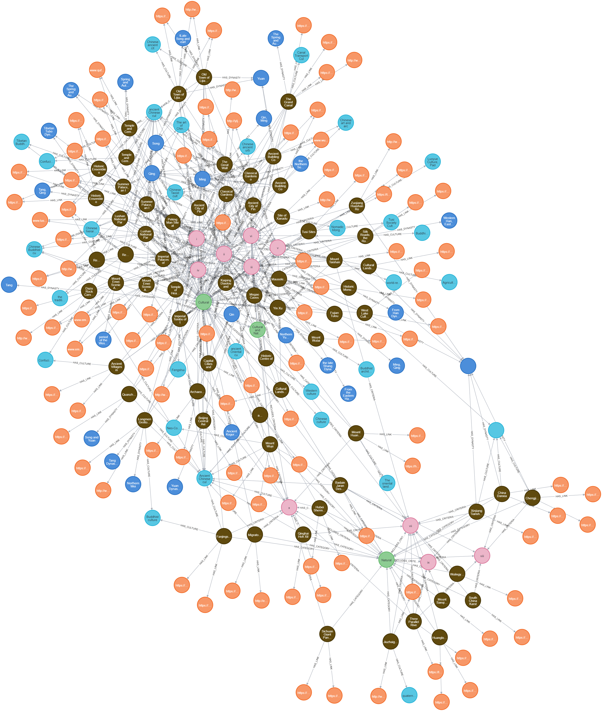

# World Heritage Smart Classroom Assistant

This project is a World Heritage Smart Classroom Assistant that utilizes a Neo4j graph database to manage and query heritage data.

## Prerequisites

- Python 3.x
- Neo4j Desktop or Neo4j Server
- `py2neo` Python package

## Installation

1. **Clone the repository**
   ```bash
   git clone <repository-url>
   cd <repository-directory>
   ```

2. **Install the required Python packages**
   ```bash
   pip install -r requirements.txt
   ```

3. **Set up Neo4j Database**
   - Download and install Neo4j Desktop or set up a Neo4j Server.
   - Create a new database and start it.
   - Update the connection details in `refined.py` or `Heritage_build.py` with your Neo4j credentials.

## Usage

1. **Run the script**
   - You can choose to run either `refined.py` or `Heritage_build.py`.
   - Execute the script using Python:
     ```bash
     python refined.py
     ```
     or
     ```bash
     python Heritage_build.py
     ```

2. **Visualize the Data**
   - Use Neo4j Browser to visualize the graph data.
   - Example visualization:

     

     

## Project Structure

- `refined.py`: Improved version of `Heritage_build.py`.
- `Heritage_build.py`: Original script for building the heritage graph.
- `data/`: Directory containing heritage data files.
- `pic/`: Directory containing images for README.
- `test/`: Directory for test scripts.

## License

This project is licensed under the MIT License. 